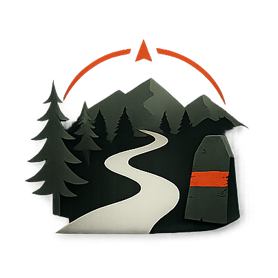

# Patika

**Yolunu kayıt et, anını yaşa.**

_Yürüyüş, koşu ve bisiklet için rota takibi; kamp yerlerini işaretleyip yorumlayabildiğin, rotalarını dışarı aktarabildiğin bir cep uygulaması._

[**▶ Uygulamayı Aç**](https://kamilsaim.github.io/patika/)

🌐 **Web sitesi:** [kamilsaim.web.app](https://kamilsaim.web.app)

---

## Patika nedir?

Patika, dışarıda geçirdiğin zamanın sessiz bir kayıt defteri. Bisikletle bir tur atarken, bir tepeye tırmanırken ya da sabah koşusuna çıkarken telefonunu cebine at, o gün nereye gittiğini ve neler yaşadığını Patika arka planda tutsun. Sonra evinde açtığında haritada rotanı, yükseklik profilini, işaretlediğin kamp yerlerini ve yol boyunca not düştüğün her şeyi bir arada görürsün.

Adı Türkiye'deki dağcıların ağaçlara ve kayalara boyadığı kırmızı-beyaz işaret taşından geliyor — Likya Yolu'nda, Aladağlar'da, Kaçkarlarda yürüyen herkesin tanıdığı o küçük işaret. Uygulamanın kayıt sırasında ekranın altında akan kırmızı-beyaz şerit de onun dijital karşılığı: "yoldayız" demenin sessiz yolu.

İleride tek başına bir kayıt defteri olmaktan çıkıp topluluk platformuna dönüşmesi hedefleniyor: yayınladığın rotayı başkalarının keşfedebilmesi, gittiğin kamp yerlerinin ortak bir haritada birikmesi, yalnız çıktığında sevdiklerinin seni link üzerinden canlı takip edebilmesi.

## Nasıl çalışır?

1. **Türü seç.** Bisiklet, yürüyüş veya koşu — Patika her birinin ritmini bilir.
2. **Kaydı başlat.** Anlık hızını, aldığın yolu, tırmandığın metreleri ve süreyi büyük, okunur bir gösterge kartında canlı görürsün.
3. **Molalarda kendini bırak.** Bir çeşmenin başında durursan Patika otomatik duraklar, tekrar yürümeye başlayınca kendiliğinden devam eder. Ortalama hızın molalarla bozulmaz.
4. **Değerli olan yerleri işaretle.** Kamp yerleri, temiz sular, manzara noktaları, tehlikeli geçitler ya da düşüp aklına gelen bir not — hepsini haritaya iğneler, yorumunu yazarsın.
5. **Rotayı sakla.** Kaydı bitirince rotana bir isim verirsin. Her rota daha sonra harita, yükseklik profili ve istatistiklerle görüntülenebilir. GPX dosyası olarak dışarı aktarıp Strava, Wikiloc veya OsmAnd gibi başka uygulamalara taşıyabilirsin.

## Öne çıkan özellikler

🗺️ **Üç harita katmanı** — Sokak, uydu ve topoğrafya (yükseklik eğrili) arasında geçiş yaparsın, seçimin hatırlanır.

⏱️ **Otomatik duraklama** — Hareket durunca kayıt kendiliğinden bekler, tekrar yola çıkınca devam eder.

📍 **Yer işaretleme** — Kamp, su, manzara, tehlike ve genel not türleriyle konum ve yoruma göre işaretler eklenir; işaretler rotaya gömülü olarak dışa aktarılır.

📈 **Yükseklik profili** — Her rotanın tırmanış-iniş grafiği çizilir; en yüksek ve en alçak noktaları görürsün.

📊 **Günlük · haftalık · aylık istatistik** — Toplam mesafe, tırmanış metresi, sürüş ve yürüyüş saatleri; çubuk grafikle görsel özet.

🏅 **Rozet sistemi** — İlk aktivite, 100 km kulübü, ilk kamp yeri, tek seferde 500 m tırmanış gibi 10 farklı rozet; kazanınca ekranda kutlama görünür.

📤 **GPX içe/dışa aktarma** — Diğer uygulamalardan gelen rotaları alır, kendi rotalarını Strava, Wikiloc, OsmAnd uyumlu GPX olarak paylaşır.

🔌 **Tamamen çevrimdışı** — İnternet olmadan da çalışır. Tüm verin senin cihazında yerel olarak durur; ayarlardan tek dosyada yedek alabilirsin.

📱 **Ana ekrana eklenince tam uygulama** — Kendi ikonuyla, splash ekranıyla, tarayıcı çubukları olmadan, uygulama gibi açılır.

## Teknoloji

Tek dosyalık bir HTML uygulaması — çerçeve, derleme veya paket yöneticisi yok. Harita için [Leaflet](https://leafletjs.com), tarayıcının konum ve kilit ekranı arayüzleri (Geolocation + Wake Lock), veri saklama için tarayıcının IndexedDB'si kullanılır. [GitHub Pages](https://pages.github.com) üzerinden yayınlanır. Uzun vadede rota paylaşımı ve canlı takip için [Supabase](https://supabase.com), Android APK için [Capacitor](https://capacitorjs.com) planlanmıştır.

## Sürüm Geçmişi

| Sürüm | Öne çıkanlar |
|-------|--------------|
| **1.5** | Hesap girişi (e-posta bağlantısı ve Google) — bulut paylaşımının ilk adımı; uygulama içi otomatik güncelleme bildirimi; tüm pencereler ekran ortasında açılıyor; silme işlemlerinde onay penceresi |
| **1.4** | iOS'ta ekrana oturma sorunları giderildi: alt menü artık ekranın dibine oturuyor, dokunuşlar şaşmıyor |
| **1.3** | Kano ve kayak eklendi; aktivite tipine göre akıllı otomatik duraklama; iOS güvenli alan düzeltmeleri |
| **1.2** | Splash ekranı, ayarlar sekmesi (istatistik, yedekleme, veri silme), PWA (ana ekrana ekle) desteği |
| **1.1** | Harita katmanı seçici: sokak, uydu, topoğrafya |
| **1.0** | İlk sürüm: canlı GPS kaydı, otomatik duraklama, yer işaretleme, yükseklik profili, GPX içe/dışa aktarma, günlük/haftalık/aylık istatistik, 10 rozet |

## Katkı

Patika henüz tek başına çalışan bir kayıt defteri; ileriki sürümlerde katkı için hesap ve rota yayınlama gelecek. Şimdilik yapabileceğin en güzel şey uygulamayı bir kez denemek, telefonunda ana ekrana eklemek ve gittiğin bir patikadan geri dönerken eksik bulduklarını iletmek.

---

Yolunu bul, izini bırak.

